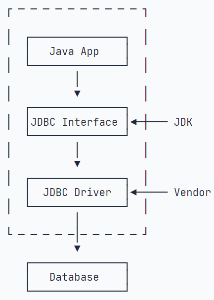
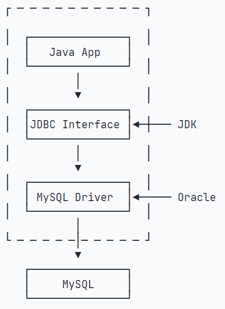
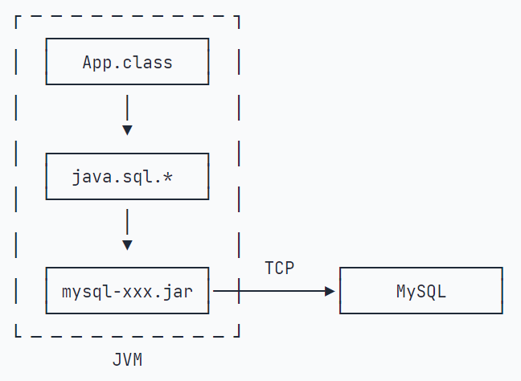
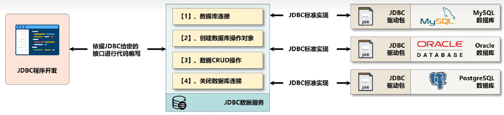
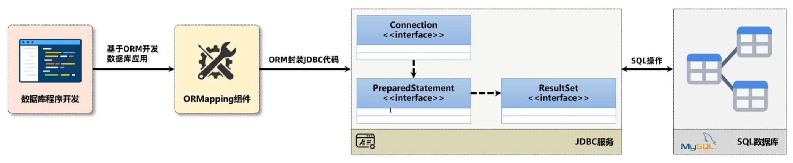
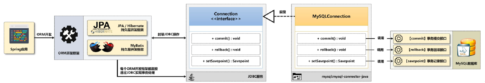
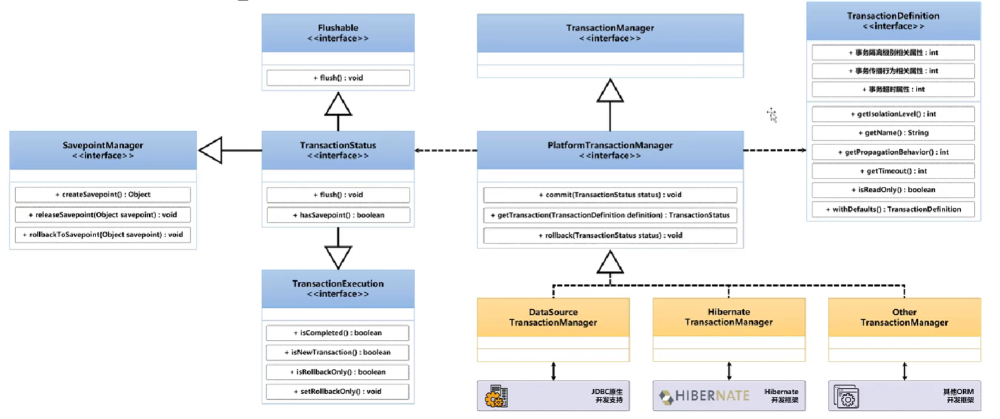
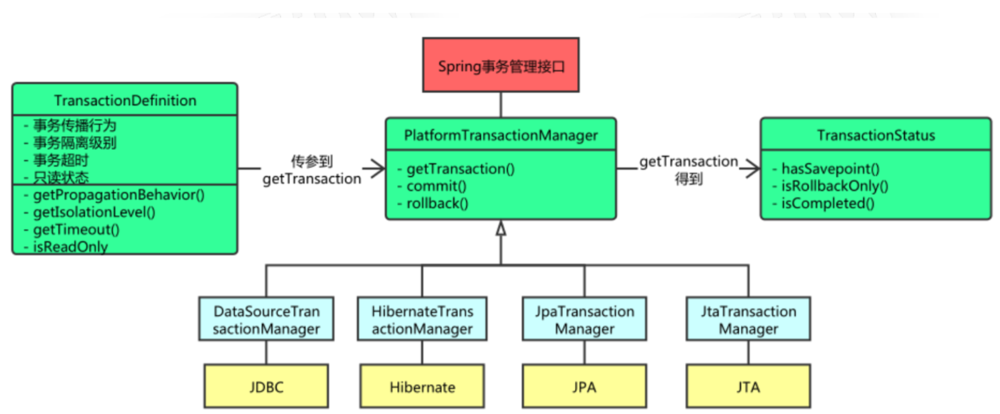
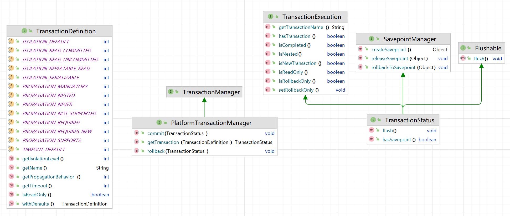
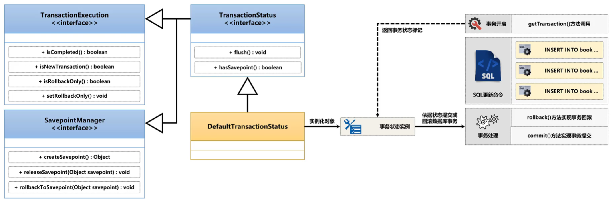

# 事务管理基础

所有Java数据库操作都要通过JDBC来实现。

## 什么是JDBC？

JDBC是Java DataBase Connectivity的缩写，它是Java程序访问数据库的标准接口。

使用Java程序访问数据库时，Java代码并不是直接通过TCP连接去访问数据库，而是通过JDBC接口来访问，而JDBC接口则通过JDBC驱动来实现真正对数据库的访问。

| 图片 | 说明 |
| ---- | ---- |
|  | **JDBC架构图**：Java程序通过JDBC接口访问不同数据库，JDBC接口由Java标准库提供，具体驱动由数据库厂商提供。 |
|  | **接口与实现**：JDBC接口定义标准规范，各数据库厂商实现这些接口来提供具体的驱动程序。JDBC接口规范在Java的标准库java.sql里。 |
|  | **实际应用**：Java程序只需引入对应的JDBC驱动jar包，就能通过统一的JDBC接口访问不同的数据库。 |





数据库操作代码：

```java
// JDBC连接的URL, 不同数据库有不同的格式:
String JDBC_URL = "jdbc:mysql://localhost:3306/test";
String JDBC_USERNAME = "username";
String JDBC_PASSWORD = "password";

// DriverManager会自动扫描classpath，找到所有的JDBC驱动，然后根据我们传入的URL自动挑选一个合适的驱动。
try (Connection conn = DriverManager.getConnection(JDBC_URL, JDBC_USERNAME, JDBC_PASSWORD)) {
    
    // 查询
    try (PreparedStatement ps = conn.prepareStatement("SELECT id, grade, name, gender FROM students WHERE gender=? AND grade=?")) {
        ps.setObject(1, "M"); // 注意：索引从1开始
        ps.setObject(2, 3);
        try (ResultSet rs = stmt.executeQuery("SELECT id, grade, name, gender FROM students WHERE gender=1")) {
            while (rs.next()) {
                long id = rs.getLong(1); // 注意：索引从1开始
                long grade = rs.getLong(2);
                String name = rs.getString(3);
                int gender = rs.getInt(4);
            }
        }
    } 
    
    // 插入
    try (PreparedStatement ps = conn.prepareStatement(
            "INSERT INTO students (id, grade, name, gender) VALUES (?,?,?,?)")) {
        ps.setObject(1, 999); // 注意：索引从1开始
        ps.setObject(2, 1); // grade
        ps.setObject(3, "Bob"); // name
        ps.setObject(4, "M"); // gender
        int n = ps.executeUpdate(); // 1
    }   
    
    // 更新
    try (Connection conn = DriverManager.getConnection(JDBC_URL, JDBC_USER, JDBC_PASSWORD)) {
        try (PreparedStatement ps = conn.prepareStatement("UPDATE students SET name=? WHERE id=?")) {
            ps.setObject(1, "Bob"); // 注意：索引从1开始
            ps.setObject(2, 999);
            int n = ps.executeUpdate(); // 返回更新的行数
        }
    }   
    
    // 删除
    try (Connection conn = DriverManager.getConnection(JDBC_URL, JDBC_USER, JDBC_PASSWORD)) {
        try (PreparedStatement ps = conn.prepareStatement("DELETE FROM students WHERE id=?")) {
            ps.setObject(1, 999); // 注意：索引从1开始
            int n = ps.executeUpdate(); // 删除的行数
        }
    }    
    
    // 批处理
    try (PreparedStatement ps = conn.prepareStatement("INSERT INTO students (name, gender, grade, score) VALUES (?, ?, ?, ?)")) {
        // 对同一个PreparedStatement反复设置参数并调用addBatch():
        for (Student s : students) {
            ps.setString(1, s.name);
            ps.setBoolean(2, s.gender);
            ps.setInt(3, s.grade);
            ps.setInt(4, s.score);
            ps.addBatch(); // 添加到batch
        }
        // 执行batch:
        int[] ns = ps.executeBatch();
        for (int n : ns) {
            System.out.println(n + " inserted."); // batch中每个SQL执行的结果数量
        }
    }    
}
```

在执行JDBC的增删改查的操作时，如果每一次操作都来一次打开连接，操作，关闭连接，那么创建和销毁JDBC连接的开销就太大了。为了避免频繁地创建和销毁JDBC连接，我们可以通过连接池（Connection Pool）复用已经创建好的连接。

JDBC连接池有一个标准的接口javax.sql.DataSource，注意这个类位于Java标准库中，但仅仅是接口。要使用JDBC连接池，我们必须选择一个JDBC连接池的实现。常用的JDBC连接池有：

- HikariCP
- C3P0
- BoneCP
- Druid

目前使用最广泛的是HikariCP。我们以HikariCP为例，要使用JDBC连接池，先添加HikariCP的依赖如下：

```xml
<dependency>
    <groupId>com.zaxxer</groupId>
    <artifactId>HikariCP</artifactId>
    <version>5.1.0</version>
</dependency>
```

```java
HikariConfig config = new HikariConfig();
config.setJdbcUrl("jdbc:mysql://localhost:3306/test");
config.setUsername("username");
config.setPassword("password");
config.addDataSourceProperty("connectionTimeout", "1000"); // 连接超时：1秒
config.addDataSourceProperty("idleTimeout", "60000"); // 空闲超时：60秒
config.addDataSourceProperty("maximumPoolSize", "10"); // 最大连接数：10

// 创建一个DataSource实例，这个实例就是连接池：
DataSource ds = new HikariDataSource(config);

try (Connection conn = ds.getConnection()) { // 在此获取连接
    ...
} // 在此“关闭”连接
```

## 什么是事务？

简单来说，事务就是把多个数据库操作打包成一个整体，要么全部成功，要么全部失败。

比如银行转账：从A账户扣钱 + 给B账户加钱，这两步必须同时成功或同时失败，不能出现扣了A的钱但B没收到的情况。

## JDBC事务控制

JDBC的事务代码：

```java
// JDBC连接配置
String JDBC_URL = "jdbc:mysql://localhost:3306/test";
String JDBC_USERNAME = "username";
String JDBC_PASSWORD = "password";

// 获取连接并执行数据库操作
try (Connection conn = DriverManager.getConnection(JDBC_URL, JDBC_USERNAME, JDBC_PASSWORD)) {
    
    // 开启事务，关闭自动提交，默认有“隐式事务”，总是处于“自动提交”模式，也就是每执行一条SQL都是作为事务自动执行的。
    conn.setAutoCommit(false);
    // 设定隔离级别，如果没有设定隔离级别，会使用数据库的默认隔离级别。
    conn.setTransactionIsolation(Connection.TRANSACTION_READ_COMMITTED);
    
    try {
        // 查询
        try (PreparedStatement ps = conn.prepareStatement("SELECT id, grade, name, gender FROM students WHERE gender=? AND grade=?")) {
            ps.setObject(1, "M");
            ps.setObject(2, 3);
            try (ResultSet rs = ps.executeQuery()) {
                while (rs.next()) {
                    long id = rs.getLong(1);
                    long grade = rs.getLong(2);
                    String name = rs.getString(3);
                    String gender = rs.getString(4);
                }
            }
        }
        
        // 插入
        try (PreparedStatement ps = conn.prepareStatement("INSERT INTO students (id, grade, name, gender) VALUES (?,?,?,?)")) {
            ps.setObject(1, 999);
            ps.setObject(2, 1);
            ps.setObject(3, "Bob");
            ps.setObject(4, "M");
            int n = ps.executeUpdate();
        }
        
        // 更新
        try (PreparedStatement ps = conn.prepareStatement("UPDATE students SET name=? WHERE id=?")) {
            ps.setObject(1, "Bob");
            ps.setObject(2, 999);
            int n = ps.executeUpdate();
        }
        
        // 删除
        try (PreparedStatement ps = conn.prepareStatement("DELETE FROM students WHERE id=?")) {
            ps.setObject(1, 999);
            int n = ps.executeUpdate();
        }
        
        // 批处理
        try (PreparedStatement ps = conn.prepareStatement("INSERT INTO students (name, gender, grade, score) VALUES (?, ?, ?, ?)")) {
            for (Student s : students) {
                ps.setString(1, s.name);
                ps.setBoolean(2, s.gender);
                ps.setInt(3, s.grade);
                ps.setInt(4, s.score);
                ps.addBatch();
            }
            int[] ns = ps.executeBatch();
        }
        
        // 提交事务
        conn.commit();
        
    } catch (SQLException e) {
        // 回滚事务
        conn.rollback();
        throw e;
    }
}
```

**什么时候需要事务？**

只有当你需要同时执行多个相关的**数据库写操作**时，才需要使用事务。具体来说：

**需要事务的场景（涉及写操作）：**

- 转账（扣钱+加钱）- 两次UPDATE操作
- 下单（减库存+创建订单+生成物流单）- 多次INSERT/UPDATE操作
- 用户注册（创建用户+初始化账户+记录日志）- 多次INSERT操作

**不需要事务的场景：**

- 单纯的查询操作（SELECT）
- 单个写操作（单次INSERT/UPDATE/DELETE）
- 多个独立的读操作

## ACID事务特性

事务有4个重要特性，简称ACID：

### 1. 原子性（Atomicity）

**要么全做，要么全不做**

- 就像原子一样不可分割
- 转账时，扣钱和加钱必须同时成功或同时失败
- 出错时会回滚到事务开始前的状态

### 2. 一致性（Consistency）

**数据始终保持正确状态**

- 转账前后，从A账户扣钱 + 给B账户加钱，总金额不变
- 不会出现数据不合理的情况

### 3. 隔离性（Isolation）

**多个事务互不干扰**

- 在并发环境访问下才会存在的问题
- 就像每个事务都在独立的房间里执行
- A用户转账时，不会被B用户的操作影响

### 4. 持久性（Durability）

**提交后永久保存**

- 事务完成后，数据会永久保存在数据库中
- 即使系统崩溃，数据也不会丢失

# Spring事务基础

Spring事务是对已有JDBC事务的进一步的包装型处理，所以底层依然是JDBC事务控制。



## 核心事务接口

```java
public interface PlatformTransactionManager extends TransactionManager {

 TransactionStatus getTransaction(TransactionDefinition definition) throws TransactionException;

 void commit(TransactionStatus status) throws TransactionException;

 void rollback(TransactionStatus status) throws TransactionException;
}
```

## 事务处理架构









## spring-tx

**`spring-tx`** JAR 提供Spring事务管理的核心功能：

- **声明式事务管理** - 使用 `@Transactional` 注解
- **编程式事务管理** - 通过 `TransactionTemplate` 手动控制事务
- **事务抽象层** - 为不同事务管理器（JPA、JDBC、JMS等）提供统一API
- **事务传播机制** - 控制方法调用时事务的行为
- **事务隔离级别** - 支持多种数据库隔离级别
- **回滚规则** - 灵活的异常回滚配置

Maven依赖：

```xml
<dependency>
    <groupId>org.springframework</groupId>
    <artifactId>spring-tx</artifactId>
</dependency>
```

**注意**：使用Spring Boot时，该依赖通常通过 `spring-boot-starter-jdbc`、`spring-boot-starter-data-jpa` 等starter自动包含。

# Spring声明式事务

**`@Transactional`** 是Spring框架提供的声明式事务管理注解，用于自动将方法或类包装在数据库事务中。

## 注解定义

```java
package org.springframework.transaction.annotation;

@Target({ElementType.TYPE, ElementType.METHOD})
@Retention(RetentionPolicy.RUNTIME)
@Inherited
@Documented
@Reflective
public @interface Transactional {
    
    @AliasFor("transactionManager")
  String value() default "";
    @AliasFor("value")
  String transactionManager() default "";  
    
    String[] label() default {}; 
    
    Propagation propagation() default Propagation.REQUIRED; 
    
    Isolation isolation() default Isolation.DEFAULT;
    
    int timeout() default TransactionDefinition.TIMEOUT_DEFAULT;
    String timeoutString() default "";
    
    boolean readOnly() default false;
    
    Class<? extends Throwable>[] rollbackFor() default {};
    String[] rollbackForClassName() default {};
    
    Class<? extends Throwable>[] noRollbackFor() default {};
    String[] noRollbackForClassName() default {};
}
```

## 注解属性详解

### 事务管理器

```java
// 指定事务管理器
@Transactional("customTransactionManager")
public void method1() { }

// 等价写法
@Transactional(transactionManager = "customTransactionManager")
public void method2() { }
```

### 事务传播机制（Propagation）

**事务传播机制核心在于控制事务的边界和多个事务方法之间的协作关系。**例如，当方法A（已开启事务）调用方法B（也需要事务管理）时，方法B是继续使用A的事务，还是自己新开一个事务，或是其他处理方式。

|      | 传播行为          | 说明                                                         | 使用场景               |
| ---- | ----------------- | ------------------------------------------------------------ | ---------------------- |
| 1    | **REQUIRED**      | Support a current transaction, create a new one if none exists. This is the default setting of a transaction annotation.<br />默认值。如果当前没有事务，就新建一个事务；如果已经存在事务，则加入该事务。 | 大多数业务方法         |
| 2    | **REQUIRES_NEW**  | Create a new transaction, and suspend the current transaction if one exists. <br />总是新建一个新的子业务事务，如果存在有父级事务则会自动将其挂起，该操作可以实现子事务的独立提交，不受调用者的事务影响，即便父级事务异常，也可以正常提交。<br/>简单理解：子业务自己拥有独立的事务，即便父事务出现了问题，也不影响子业务的处理。 | 独立的日志记录、审计   |
| 3    | **SUPPORTS**      | Support a current transaction, execute non-transactionally if none exists. <br />如果当前父业务存在有事务，则加入该父级事务。如果当前不存在有父级事务，则以非事务方式运行。<br/>简化的理解：如果现在有事务支持就使用事务的处理方式，如果没有事务的支持，那么就采用事务裸奔的方式运行。 | 查询方法               |
| 4    | **NOT_SUPPORTED** | Execute non-transactionally, suspend the current transaction if one exists. <br />以非事务的方式运行，如果当前存在有父级事务，则先自动挂起父级事务后运行。<br/>简化理解：在进行其他业务调用的时候，不管是否存在有事务统一关闭。 | 不需要事务的操作       |
| 5    | **MANDATORY**     | Support a current transaction, throw an exception if none exists. <br />如果当前存在父级事务，则运行在父级事务之中，如果当前无事务则抛出异常。<br/>简化理解：必须存在有父级事务 | 强制事务上下文的方法   |
| 6    | **NEVER**         | Execute non-transactionally, throw an exception if a transaction exists. <br />以非事务方式执行，如果当前存在事务，则抛出异常。 | 绝对不能在事务中的操作 |
| 7    | **NESTED**        | Execute within a nested transaction if a current transaction exists, behave like REQUIRED otherwise.<br />如果当前存在父级事务，则当前子业务中的事务会自动成为该父级事务中的一个子事务，只有在父级事务提交后才会提交子事务。如果子事务产生异常则可以交由父级调用进行异常处理，如果父级事务产生异常，则其也会回滚。<br />简化理解：所有的事务统一交给调用业务处处理。<br />如果当前没有事务，等同于REQUIRED。 | 部分回滚场景           |

### 事务隔离级别（Isolation）

**什么是事务隔离级别？**

想象一下图书馆的场景：多个人同时在借阅和归还同一本书，如果没有规则，就会出现混乱。事务隔离级别就是数据库为了解决多个事务同时操作同一数据时的"冲突规则"。

**为什么需要隔离级别？**

在实际项目中，经常有多个用户同时操作数据库：

- 用户A正在查看商品库存
- 用户B同时在购买这个商品
- 用户C在修改商品信息

如果没有隔离控制，就会出现数据混乱的问题。

**常见的并发问题详解：**

#### 1. 脏读（Dirty Read）

**定义**：读取的是**未提交**的数据

**特征**：
- 读到的数据可能是"假的"，因为写事务可能会回滚
- 就像看到别人写了一半的草稿，内容可能随时被撤销
- 可能读到完全错误的数据，基于错误数据做决策会导致严重后果

**解决方案**：禁止读取未提交数据，使用READ_COMMITTED及以上隔离级别

**记忆技巧**："脏"=不干净=未提交=可能是假的

#### 2. 不可重复读（Non-Repeatable Read）

**定义**：读取的是**已提交**的数据，针对**已存在的具体记录**

**特征**：
- 读到的数据都是"真的"，只是在事务期间被其他事务修改了
- 关注的是同一条记录的**值**是否发生变化
- 例如：用户ID=1的余额从1000变成800
- 主要影响数据一致性，但不会基于错误数据做决策

**解决方案**：通过**行级锁**解决，锁定读取的数据行，使用REPEATABLE_READ及以上隔离级别

**记忆技巧**：数据是真的，但"重复读取结果不同"

#### 3. 幻读（Phantom Read）

**定义**：读取的是**已提交**的数据，针对**记录的数量**

**特征**：
- 关注的是查询结果集中**记录数**是否发生变化
- 例如：符合条件的用户从10个变成12个
- 通常由INSERT/DELETE操作引起

**解决方案**：需要**范围锁/间隙锁**解决，不仅锁定已存在的行，还要锁定可能插入新记录的"间隙"

**记忆技巧**：数量变了，像"幻觉"一样突然多了或少了记录

**三大并发问题核心对比：**

| 问题类型 | 数据状态 | 关注点 | 触发操作 | 解决方案 | 记忆口诀 |
|---------|---------|--------|----------|----------|----------|
| **脏读** | 未提交数据 | 数据真假性 | ROLLBACK | 使用READ_COMMITTED及以上隔离级别 | 读到假数据 |
| **不可重复读** | 已提交数据 | 记录值变化 | UPDATE | 行级锁 | 内容变了 |
| **幻读** | 已提交数据 | 记录数量变化 | INSERT/DELETE | 范围锁/间隙锁 | 数量变了 |

**场景示例：**

```sql
-- 脏读：读到未提交的"假数据"
事务A: SELECT balance FROM account WHERE id=1; -- 读到500
事务B: UPDATE account SET balance=500 WHERE id=1; ROLLBACK; -- 回滚！
结果：A读到的500是假的，实际还是1000

-- 不可重复读：同一记录值发生变化
事务A: SELECT balance FROM account WHERE id=1; -- 读到1000
事务B: UPDATE account SET balance=800 WHERE id=1; COMMIT;
事务A: SELECT balance FROM account WHERE id=1; -- 读到800
结果：同一条记录的值变了

-- 幻读：记录数量发生变化
事务A: SELECT COUNT(*) FROM account WHERE balance>500; -- 10条
事务B: INSERT INTO account VALUES(11,'new',600); COMMIT;
事务A: SELECT COUNT(*) FROM account WHERE balance>500; -- 11条
结果：符合条件的记录数量变了
```

#### 4. 四种隔离级别

| 隔离级别 | 解决问题 | 剩余问题 | 使用场景 | 性能 |
|---------|---------|----------|----------|------|
| READ_UNCOMMITTED | 无 | 脏读+不可重复读+幻读 | 几乎不用 | 最高 |
| **READ_COMMITTED** | 脏读 | 不可重复读+幻读 | **最常用** | 较高 |
| REPEATABLE_READ | 脏读+不可重复读 | 幻读 | 金融交易，MySQL默认 | 较低 |
| SERIALIZABLE | 全部解决 | 无 | 极高要求场景 | 最低 |

**应用示例：**
```java
@Transactional // 默认级别，适合大多数场景
@Transactional(isolation = Isolation.REPEATABLE_READ) // 金融交易
@Transactional(isolation = Isolation.SERIALIZABLE) // 报表统计
```

**选择原则：** 隔离级别↑ = 数据安全↑ + 性能↓

**实际项目中的选择建议：**

1. **一般业务系统**：使用READ_COMMITTED
   - 平衡了性能和数据一致性
   - 避免脏读，可接受不可重复读和幻读

2. **金融系统**：使用REPEATABLE_READ
   - 确保账户余额等关键数据的一致性
   - 可接受轻微的性能损失

3. **报表统计**：使用SERIALIZABLE
   - 确保统计数据的绝对准确性
   - 通常在低并发时段执行

4. **高并发读取**：使用READ_UNCOMMITTED（谨慎使用）
   - 仅在对数据准确性要求不高的场景
   - 如访问量统计、日志记录等

**注意事项：**
- 不同数据库对隔离级别的实现可能有差异
- MySQL默认使用REPEATABLE_READ
- Oracle、PostgreSQL默认使用READ_COMMITTED
- 可以在方法级别动态调整隔离级别

### 标签（Label）

用于为事务添加描述性标签，便于监控和调试：

```java
@Transactional(label = {"user-operation", "critical"})
public void updateUserProfile(User user) {
    // 业务逻辑
}
```

### 超时设置

```java
// 设置超时时间（秒）
@Transactional(timeout = 30)
public void longRunningOperation() { }

// 使用字符串形式（支持SpEL表达式）
@Transactional(timeoutString = "${app.transaction.timeout}")
public void configurableTimeout() { }
```

### 只读事务

```java
@Transactional(readOnly = true)
public User findUser(Long id) {
    // 只读事务，优化性能，防止意外修改
    return userRepository.findById(id);
}
```

### 回滚规则

#### 默认回滚行为

- **运行时异常**（RuntimeException及其子类）：自动回滚
- **检查异常**（Exception及其子类，除RuntimeException）：不回滚
- **错误**（Error及其子类）：自动回滚

#### 自定义回滚规则

```java
@Service
public class UserService {
    
    // 指定特定异常回滚
    @Transactional(rollbackFor = {IOException.class, SQLException.class})
    public void createUserWithFile(User user, File file) throws IOException {
        userRepository.save(user);
        fileService.uploadFile(file);  // IOException会触发回滚
    }
    
    // 指定异常不回滚
    @Transactional(noRollbackFor = IllegalArgumentException.class)
    public void updateUser(User user) {
        if (user.getId() == null) {
            throw new IllegalArgumentException("User ID cannot be null");
            // 不会回滚事务
        }
        userRepository.save(user);
    }
    
    // 使用类名字符串
    @Transactional(
        rollbackForClassName = {"java.io.IOException", "java.sql.SQLException"},
        noRollbackForClassName = {"java.lang.IllegalArgumentException"}
    )
    public void complexOperation() {
        // 复杂的回滚规则
    }
}
```

#### 编程式回滚

```java
@Service
public class OrderService {
    
    @Transactional
    public void processOrder(Order order) {
        try {
            orderRepository.save(order);
            paymentService.processPayment(order);
        } catch (PaymentException e) {
            // 手动标记回滚
            TransactionAspectSupport.currentTransactionStatus().setRollbackOnly();
            throw e;
        }
    }
}
```

## 注解继承规则

### 基本继承行为

类级别的 `@Transactional` 注解会应用到该类及其子类的所有方法，但**不会向上影响祖先类**。

```java
// 祖先类
public class BaseService {
    public void baseMethod() { }     // 无事务
}

// 父类
public class ParentService extends BaseService {
    public void parentMethod() { }   // 无事务
}

// 子类
@Transactional  // 类级别注解
public class ChildService extends ParentService {
    
    public void childMethod1() { }    // 继承类级别事务
    
    @Transactional(readOnly = true)   // 方法级别覆盖类级别
    public void childMethod2() { }    // 使用只读事务
    
    // 重新声明继承的方法以获得事务支持
    @Override  
    public void parentMethod() {
        super.parentMethod();         // 现在有事务
    }
    
    // baseMethod() 仍然无事务（未重新声明）
}

// 后代类
public class GrandChildService extends ChildService {
    public void grandChildMethod() { }    // 继承父类的类级别事务
}
```

### 方法可见性限制

```java
@Transactional
public class Service {
    public void publicMethod() { }       // 事务生效
    protected void protectedMethod() { } // 事务生效  
    void packageMethod() { }             // 事务生效
    private void privateMethod() { }     // 事务不生效（Spring无法代理）
}
```

### 核心要点

1. **向下继承**：子类自动继承父类的类级别 `@Transactional`
2. **不向上影响**：子类的注解不会影响祖先类的方法
3. **方法覆盖**：方法级别注解优先于类级别
4. **重新声明**：要让继承的方法有事务，必须在子类中重新声明
5. **可见性限制**：只有 public/protected/package 方法的事务才生效

## 注解工作原理

`TransactionInterceptor`类的`invoke`方法是事务管理的核心。它会在方法执行前后进行拦截，创建事务上下文，根据方法上的`@Transactional`注解属性获取事务配置信息，如传播级别和异常信息。然后，它会检查是否已经存在一个事务上下文，根据传播级别决定是否需要创建新事务。如果需要，它会生成一个新的事务上下文对象`TransactionInfo`。接着，它会开启事务，获取数据库连接，关闭连接的自动提交，然后执行目标方法。如果方法执行过程中抛出异常，它会根据注解配置决定是否回滚事务。如果没有异常，它会提交事务。

`TransactionInterceptor`类核心代码：

```java
public class TransactionInterceptor extends TransactionAspectSupport implements MethodInterceptor, Serializable {

    // Transaction interceptor entry point
 public Object invoke(MethodInvocation invocation) throws Throwable {
  Class<?> targetClass = (invocation.getThis() != null ? AopUtils.getTargetClass(invocation.getThis()) : null);
  return invokeWithinTransaction(invocation.getMethod(), targetClass, invocation::proceed);
 }

}
```

`TransactionAspectSupport`类核心代码：

```java
public abstract class TransactionAspectSupport implements BeanFactoryAware, InitializingBean {

 protected Object invokeWithinTransaction(Method method, @Nullable Class<?> targetClass,
   final InvocationCallback invocation) throws Throwable {

        // If the transaction attribute is null, the method is non-transactional.
  TransactionAttributeSource tas = getTransactionAttributeSource();
        
        // Transaction attribute parsing
  final TransactionAttribute txAttr = (tas != null ? tas.getTransactionAttribute(method, targetClass) : null);
        
        // Determine the specific transaction manager to use for the given transaction.
  final TransactionManager tm = determineTransactionManager(txAttr, targetClass);
        
  // Start transaction
  TransactionInfo txInfo = createTransactionIfNecessary(ptm, txAttr, joinpointIdentification);

  Object retVal;
  try {
   // Invoke business method
   retVal = invocation.proceedWithInvocation();
  } catch (Throwable ex) {
   // Rollback transaction
   completeTransactionAfterThrowing(txInfo, ex);
   throw ex;
  }
  // Commit transaction
  commitTransactionAfterReturning(txInfo);
  return retVal;
 }

}
```

## 注解生效原理

### 自动配置

Spring Boot通过 `TransactionAutoConfiguration` 自动启用事务管理，通常无需手动配置：

```java
@SpringBootApplication  // 已包含事务自动配置
public class Application {
    public static void main(String[] args) {
        SpringApplication.run(Application.class, args);
    }
}
```

### 手动配置

**场景1：自定义事务配置**

```java
@SpringBootApplication
@EnableTransactionManagement(proxyTargetClass = true)  // 强制使用CGLIB代理
public class Application {
    // ...
}
```

**场景2：专门的配置类**

```java
@Configuration
@EnableTransactionManagement
public class TransactionConfig {
    
    @Bean
    public PlatformTransactionManager transactionManager() {
        return new DataSourceTransactionManager(dataSource());
    }
}
```

### 代理模式

**JDK动态代理 vs CGLIB代理**

```java
// 配置代理模式
@EnableTransactionManagement(
    mode = AdviceMode.PROXY,           // 代理模式（默认）
    proxyTargetClass = true,           // 强制使用CGLIB
    order = Ordered.LOWEST_PRECEDENCE  // AOP顺序
)
public class TransactionConfig {
    // 配置
}
```

| 代理类型        | 适用场景       | 优缺点                        |
| --------------- | -------------- | ----------------------------- |
| **JDK动态代理** | 实现了接口的类 | 性能好，但需要接口            |
| **CGLIB代理**   | 没有接口的类   | 无需接口，但不能代理final方法 |

## 常见应用示例

### 服务层事务

```java
@Service
@Transactional  // 类级别默认配置
public class UserService {
    
    // 继承类级别事务配置
    public void createUser(User user) {
        userRepository.save(user);
        emailService.sendWelcomeEmail(user);
    }
    
    // 只读查询优化
    @Transactional(readOnly = true)
    public List<User> findActiveUsers() {
        return userRepository.findByStatus(UserStatus.ACTIVE);
    }
    
    // 独立事务处理
    @Transactional(propagation = Propagation.REQUIRES_NEW)
    public void logUserActivity(Long userId, String activity) {
        activityRepository.save(new UserActivity(userId, activity));
    }
}
```

### 多数据源事务

```java
@Configuration
public class TransactionConfig {
    
    @Bean
    @Primary
    public PlatformTransactionManager primaryTransactionManager() {
        return new DataSourceTransactionManager(primaryDataSource());
    }
    
    @Bean
    public PlatformTransactionManager secondaryTransactionManager() {
        return new DataSourceTransactionManager(secondaryDataSource());
    }
}

@Service
public class MultiDataSourceService {
    
    @Transactional  // 使用主事务管理器
    public void primaryOperation() {
        primaryRepository.save(entity);
    }
    
    @Transactional("secondaryTransactionManager")
    public void secondaryOperation() {
        secondaryRepository.save(entity);
    }
}
```

## 常见问题排查

### 内部调用不会触发事务代理

```java
@Service
public class ProblematicService {
    
    @Transactional
    public void outerMethod() {
        // ❌ 内部调用不会触发事务代理
        this.innerMethod();
    }
    
    @Transactional(propagation = Propagation.REQUIRES_NEW)
    public void innerMethod() {
        // 不会创建新事务！
    }
    
    // ✅ 正确做法：通过其他Bean调用
    @Autowired
    private SelfService selfService;
    
    @Transactional
    public void correctOuterMethod() {
        selfService.innerMethod();  // 会正确创建新事务
    }
}
```

### 异步方法中事务不会正确传播

```java
@Service
public class AsyncService {
    
    @Transactional
    @Async  // ❌ 异步方法中事务不会正确传播
    public CompletableFuture<Void> asyncMethod() {
        // 事务在新线程中不可用
        return CompletableFuture.completedFuture(null);
    }
    
    // ✅ 正确做法：分离事务和异步
    @Async
    public CompletableFuture<Void> correctAsyncMethod() {
        return CompletableFuture.supplyAsync(() -> {
            transactionalService.doWork();
            return null;
        });
    }
}
```

# Spring编程式事务

```java
@Service
public class ProgrammaticTransactionService {
    
    @Autowired
    private TransactionTemplate transactionTemplate;
    
    public void executeInTransaction() {
        transactionTemplate.execute(status -> {
            // 事务代码
            userRepository.save(user);
            
            if (someCondition) {
                status.setRollbackOnly();  // 标记回滚
            }
            
            return null;
        });
    }
    
    // 带返回值的事务
    public User createUserProgrammatically(User user) {
        return transactionTemplate.execute(status -> {
            User savedUser = userRepository.save(user);
            emailService.sendWelcomeEmail(savedUser);
            return savedUser;
        });
    }
}
```

# 参考资料

[Transaction Management](https://docs.spring.io/spring-framework/reference/data-access/transaction.html)

[Understanding the Spring Framework Transaction Abstraction](https://docs.spring.io/spring-framework/reference/data-access/transaction/strategies.html)

[【java框架】SpringJDBC数据库编程](https://www.bilibili.com/video/BV1Ne4y1f7aB?spm_id_from=333.1387.favlist.content.click)

[【java框架】Spring事务处理架构](https://www.bilibili.com/video/BV1od4y1o75v?spm_id_from=333.1387.favlist.content.click)
